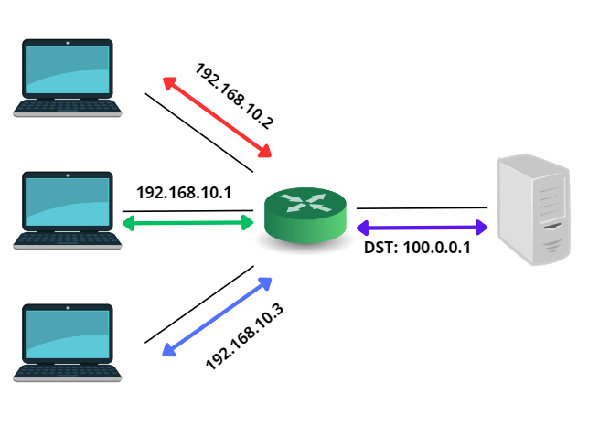
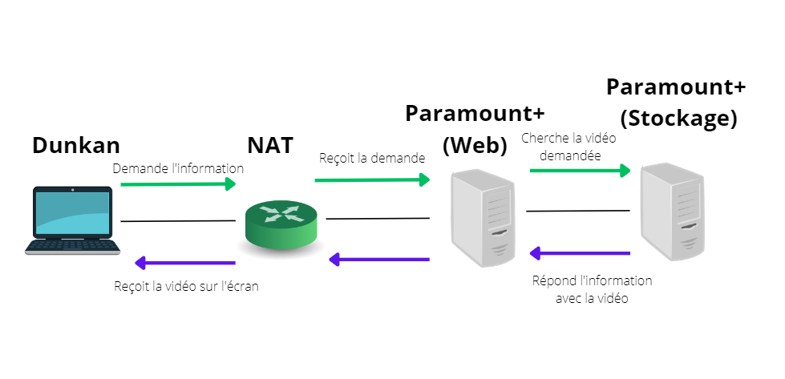

# Docker

https://hub.docker.com/repository/docker/nyftheart/serveur/general

# Cloud computing

- Pour vous c'est quoi le Cloud ?
  -> Le Cloud est une technologie qui permet de stocker, gérer et traiter des données et des applications à distance via Internet, plutôt que localement sur un ordinateur ou un serveur.

- Donnez les avantages d'utilisation du Cloud
  -> Les avantages de l'utilisation du Cloud incluent la flexibilité, la scalabilité, la disponibilité, la sécurité, la réduction des coûts d'infrastructure informatique et la facilité de collaboration et de partage de données entre les utilisateurs.

- C'est quoi le Network Adress Translation (NAT) ?
  -> C'est une technologie qui permet à un routeur de modifier l'adresse IP source d'un paquet de données en transit sur un réseau, afin de permettre à plusieurs appreils de partager une adresse IP publique unique pour accéder à Internet.

- Quels sont les différents type de NAT. Illustrez vos explication via des dessin à la main. Vous mettrez des images dans ce package.
  -> Il existe trois type de NAT:
1) NAT statique:
   il permet de traduire de manière permanente une adresse IP privée en une adresse IP publique unique. Cela permet aux appareils internes d'être accessibles de l'extérieur à partir d'Internet.
   
   

2) NAT dynamique:
   il permet de traduire de manière temporaire une adresse IP privée en une adresse IP publique unique, en utilisant un pool d'adresses IP publiques disponibles. Cela permet à plusieurs appareils internes de partager une adresse IP publique.
   
   

3) NAT de surcharge
   il permet de traduire plusieurs adresses IP privées en une adresse IP publique unique en utilisant différents ports pour identifier chaque connexion. Cela permet à plusieurs appareils internes de partager une adresse IP publique unique et de communiquer simultanément avec des serveurs externes.

   

- Quels sont les services amazon web services que vous connaissez ? Que font-ils ?
  -> Amazon S3 (Simple Storage Service) : service de stockage en ligne évolutif et hautement disponible.
  Amazon Lambda : service de traitement des événements sans serveur qui permet d'exécuter du code en réponse à des événements, sans avoir à gérer l'infrastructure sous-jacente.
  Amazon DynamoDB : service de base de données NoSQL entièrement géré et hautement disponible, capable de gérer des charges de travail à latence faible et de haute performance.
  Amazon SQS (Simple Queue Service) : service de file d'attente entièrement géré qui permet aux applications de communiquer entre elles de manière fiable et asynchrone.

- Dunkan à la maison accède à la série Rabbit Hole sur la plateforme de vidéo en ligne Paramount+.
  Expliquez le processus NAT Port Adress Translation montrant le traffic depuis la rêquete pour récupérer la vidéo jusqu'à l'apparition sur son écran
  -> Dunkan est sur l'ordinateur, il envoie l'information à la box qui enverra ensuite chez les serveurs de Paramount+.
  Dès que le serveur de Paramount+ recevra l'information et il retourne l'information dans le sens inverse jusqu'à l'ordinateur ce qui va afficher la vidéo sur l'écran de Dunkan à la maison

Illustrez vos explication au travers de schemas.
-> 